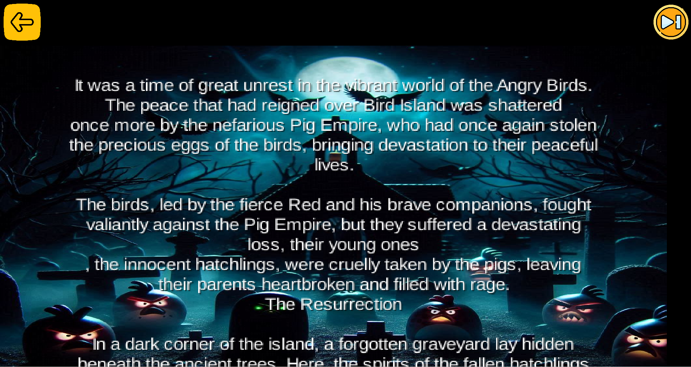
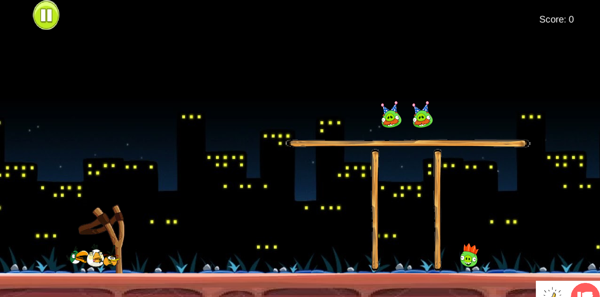
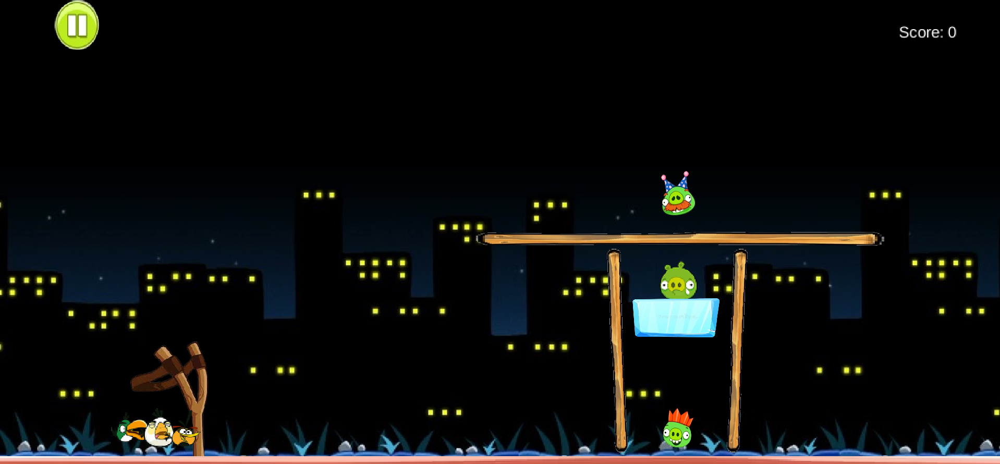
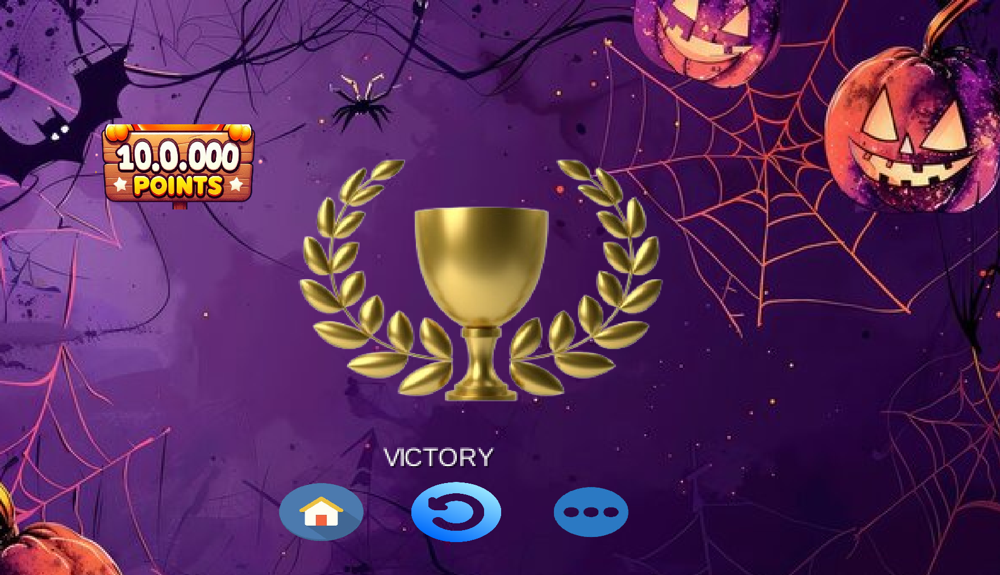
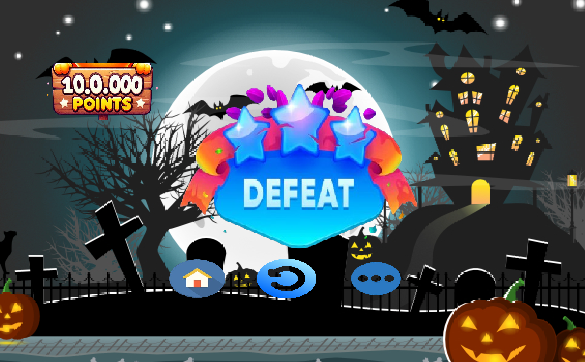
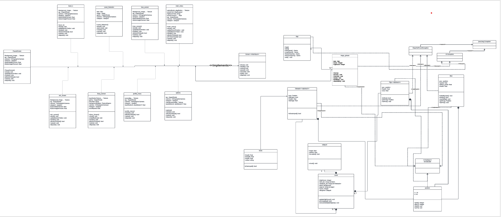
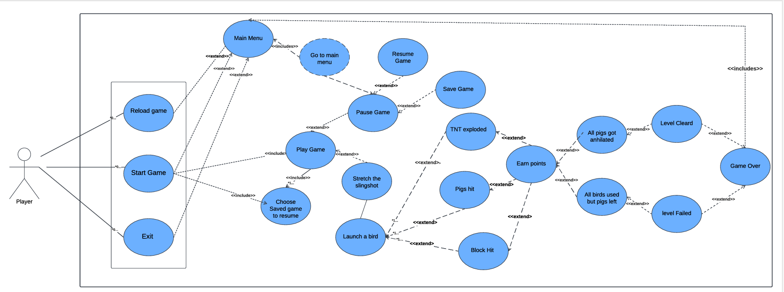

# Angry Birds Dead Hour

:star:**Please star the repository if you happen to like the project**

**Angry Birds Dead Hour** is a **HORROR** adaptation of the classic Angry Birds saga. In this version, the Angry Birds have come back as ghosts to seek revenge on the pigs who wronged them. With a haunting new atmosphere, players must control these ghostly birds to overcome obstacles, defeat enemies, and bring peace back to their realm. The pigs are in for the fright of their lives as they attempt to defend themselves from these otherworldly attackers!

## Table of Contents

- [Tech Stack](#tech-stack)
- [Salient Features](#salient-features)
- [Visuals and Gameplay](#visuals--gameplay)
- [How to Run the Game](#how-to-run-the-game)
- [Designs](#designs)
- [License](#license)
- [Creators](#creators)
  
## 💻 Tech Stack

- Java
- LibGDX
- Box2D
- IO (Serialization and De-serialization)

## 💡Salient Features

- Fully functional game with with lots of additional features
- Audio features and narration of story added
- AutoSave of the game when change the screen
- 3 kinds of pigs
- Choice between 3 kinds of birds
- Used Box2d to implement the physics world of the game

## 👀 Visuals and Gameplay

The users are greeted with a narrated story screen on Level-1.

They further have the options to play one of three-levels, each with different structures.
There are three types of pigs and three types of birds.

The aim is to destroy all the birds and gain >=1500 score for winning the level. Accordingly, the defeat and victory screens are displayed.

## How to Run the Game

If you want to just play the game, you can simply download the ZIP file or the JAR file from the release section.
If you want to play around the code, you can follow the below steps:-
1. Clone the repo
2. Go to lwjgl3/src/main/java/angry/birds/game/lwjgl3/Lwjgl3Launcher.java and simply run the Launcher file.
3. Enjoy the game.

## Designs 

You can also find the pdfs of these in the assets folder.
UML Diagram -

Use Case Diagram - 

## License
Angry Birds Dead Hour is developed as a fan-based project and is not officially associated with the original Angry Birds series by Rovio Entertainment. This project is intended for educational and personal entertainment purposes only. This is licensed under the MIT license.

## Creators:
[Sanchit Maini](https://github.com/Sanchit-100) & [Saksham Mishra](https://github.com/SakshamMishra2023)

